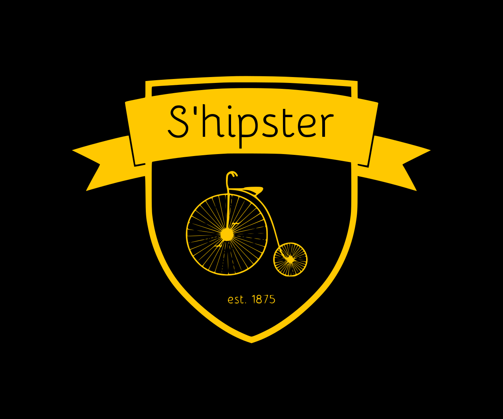

# Shipster

### Shipping made easy and fun
[Link to the deployed app](https://shipster-app.herokuapp.com/)

To run the application locally:

1: download and install [Docker Desktop](https://www.docker.com/products/docker-desktop/) and make sure it is running.

2: Open the project and select the DevUp configuration (you might have to select docker from the dropdown in the config menu).

3: Go to localhost port 8080 to access the application

After starting the application to access certain endpoints, one needs to authenticate. To do that you can go to the register (sign up) page, register and
then use your credentials to log in.

A user automatically gets the user role "USER" assigned. This doesn't give access to the admin page. To access the admin page use the admin account:

Username: admin

Password: password

Have fun!
